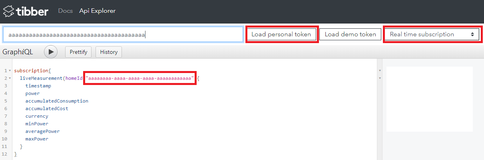

# tibberpulse-influxdb-rpi
Fetch Tibber Pulse data from the Tibber Pulse API web socket and place it in your influxdb.

Based on oysteoh's [tibber-pypulse-ws](https://github.com/oysteoh/tibber-pypulse-ws).

## How to obtain Tibber Token and home ID
### Tibber Token
- Go to https://developer.tibber.com/ and Sign in.
- Genrerate a new token.

### Home ID
- After generating your token go to https://developer.tibber.com/explorer
- Make sure you are signed in.
- Click "Load Personal Token"
- From the dropdown to the right choose "Real time subscriptions"
- You can now see your homeId in the GraphiQL code.



## How to run
```
docker run -d \
 -e INFLUXDB_HOST="localhost" \
 -e INFLUXDB_PORT="8086" \
 -e INFLUXDB_USER="root" \
 -e INFLUXDB_PW="root" \
 -e INFLUXDB_DATABASE="tibberPulse" \
 -e TIBBER_TOKEN="" \
 -e TIBBER_HOMEID="" \
 --name "tibberpulse-influxdb" \
turbosnute/tibberpulse-influxdb-rpi:latest
```

